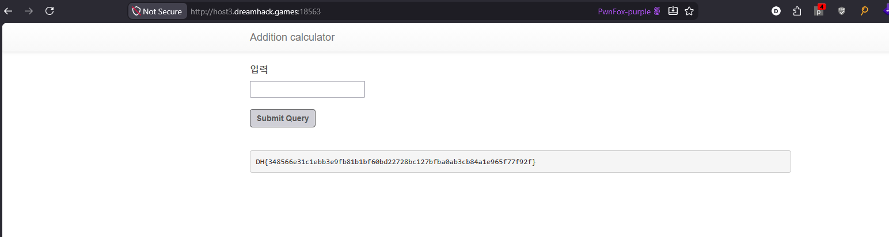

I used Challenge Hint and a little googling to solve this chall 

Base on this blog https://medium.com/@debasissadhu712/picoctf-3v-l-writeup-exploiting-python-eval-for-rce-bypassing-regex-ce85f1dc8c1e

And tried on my local

```python
import re
import string

def filter(formula):
    w_list = list(string.ascii_lowercase + string.ascii_uppercase + string.digits)
    w_list.extend([" ", ".", "(", ")", "+"])

    if re.search("(system)|(curl)|(flag)|(subprocess)|(popen)", formula, re.I):
        return True
    for c in formula:
        if c not in w_list:
            return True

formula = "open(chr(102)+chr(108)+chr(97)+chr(103)+chr(46)+chr(116)+chr(120)+chr(116)).read()"

if filter(formula):
    print("Block!")
else:
    formula = eval(formula)
    print(formula) #DH{sample}
```

Flag:

