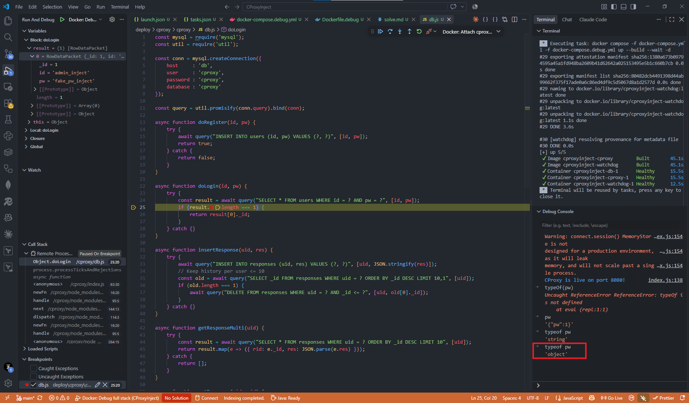
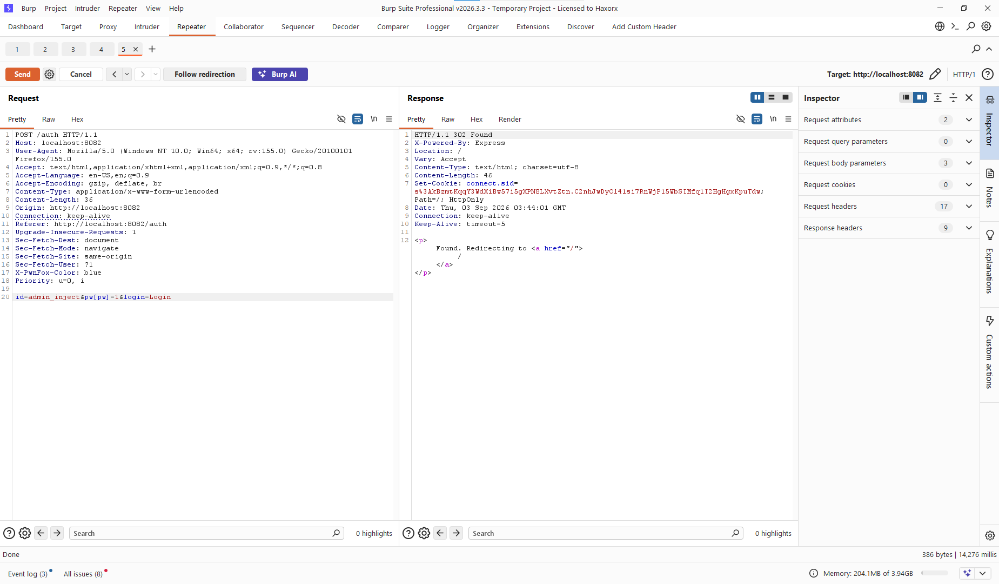
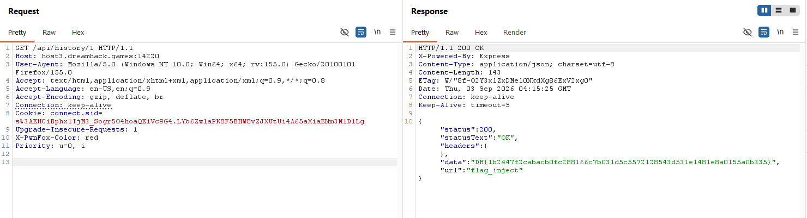

# CProxy — Prepared Statement Object Injection Write-up

After reading the challenge description, I noticed that the author had already hinted at the intended approach: gain access to the `admin_inject` account and retrieve the flag from its response records.

However, after reviewing the source code, I was still unsure how to solve the challenge. At first glance, it was difficult to identify the vulnerability as SQL injection because the application uses prepared statements, a mechanism commonly used to prevent SQL injection attacks.

However, after reading the following article, everything became much clearer: prepared statements can still be vulnerable under certain circumstances.

<https://blog.mantrainfosec.com/blog/18/prepared-statements-prepared-to-be-vulnerable>

MySQL’s default behavior, when the `stringifyObjects: true` option is not enabled, can lead to a Prepared Statement Object Injection vulnerability.

During my first attempt, I reproduced the attack described in the blog post. However, I encountered several issues because the application always returned an `Unauthorized` error. Therefore, I had to set up a debugging environment to investigate the cause.



The issue was that the application did not use middleware to parse JSON data. Instead, it expected the request body to be encoded as `application/x-www-form-urlencoded`.

Another important factor is the default behavior of [`express.urlencoded()` in Express 4.x](https://expressjs.com/en/4x/api.html#express.urlencoded). The application registers the middleware without passing any options:

```javascript
app.use(express.urlencoded());
```

In Express 4.x, omitting the `extended` option causes it to default to `true`. In this mode, Express uses the `qs` parser, which supports nested object structures in URL-encoded input. Consequently, the parameter `pw[pw]=1` is parsed into an object similar to the following:

```javascript
{
    pw: {
        pw: "1"
    }
}
```

This nested object is then passed to the MySQL driver instead of an ordinary password string, making Prepared Statement Object Injection possible. This Express parsing behavior is therefore a necessary part of why the exploit succeeds.

Therefore, I modified the payload accordingly and successfully executed the attack. Since we already know that the administrator’s ID is `admin_inject`, we only need to inject an object into the `pw` field to alter the query’s logic.

```text
id=admin_inject&pw[pw]=1&login=Login
```



After successfully exploiting the vulnerability, we obtain a valid session belonging to `admin_inject`. The next step is to retrieve the response records associated with this account from the database.

```sql
USE `cproxy`;

INSERT INTO users (_id, id, pw) VALUES (1, 'admin_inject', 'fake_pw_inject');
INSERT INTO users (_id, id, pw) VALUES (2, 'admin_watchdog', 'fake_pw_watchdog');

INSERT INTO responses (_id, uid, res) VALUES (1, 1, '{"status":200,"statusText":"OK","headers":{},"data":"DH{sample_flag_inject}","url":"flag_inject"}');
```

By reviewing the source code, we can determine that the flag is stored in the `responses` table with an ID of `1`. We can then use the `/api/history/:rid` endpoint to retrieve the response record with ID `1` and obtain the flag.

```javascript
app.get('/api/history/:rid(\\d+)', requireAuth, async (req, res) => {
    const rid = parseInt(req.params.rid, 10);
    const result = await db.getResponse(req.session.uid, rid);
    if (result === undefined) {
        return res.sendStatus(404);
    } else {
        return res.send(result);
    }
});
```

Therefore, after authenticating as `admin_inject`, accessing `/api/history/1` returns the response record containing the flag.


